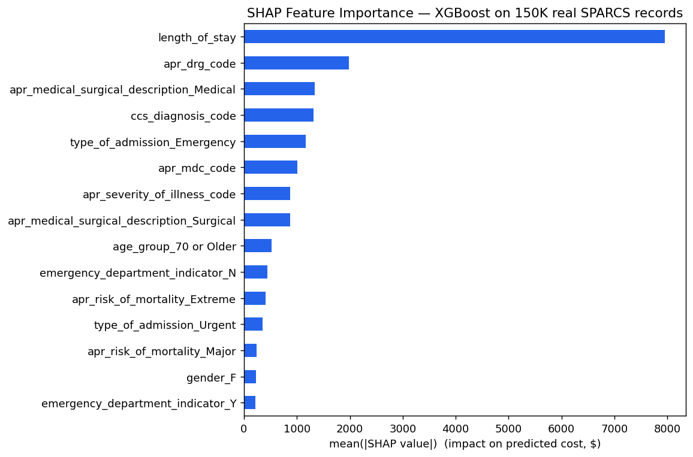
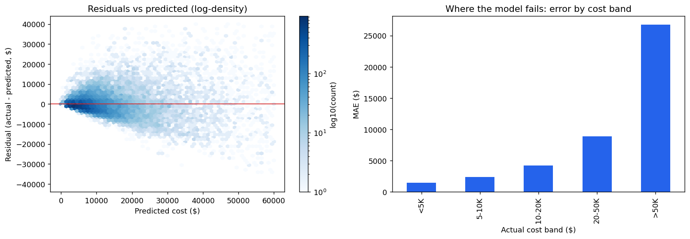

# Hospital Inpatient Cost Predictor v2

Predicts total hospital inpatient costs from patient demographics and clinical data on **2.5M real SPARCS discharge records** — best model (Random Forest) reaches **R² = 0.823, RMSE = $3,454**.
Rebuilt with a modern ML stack, REST API, interactive dashboard, and full Docker deployment.

---

## Live App

- Streamlit: https://hospitalcostpred.streamlit.app/

---

## Model Performance

**v2 pipeline** — trained on a 150K-row spaced sample of real SPARCS data (committed in `data/`, 70/15/15 split, 18 features):

| Model | R² | RMSE | MAE |
|---|---:|---:|---:|
| **LightGBM** | **0.876** | **$7,335** | **$3,234** |
| XGBoost | 0.866 | $7,614 | $3,320 |
| Random Forest | 0.861 | $7,753 | $3,358 |
| PyTorch MLP (BatchNorm + Dropout) | 0.856 | $7,896 | $3,726 |
| Ridge (linear baseline) | 0.726 | $10,890 | $5,745 |

LightGBM cuts RMSE by **33% vs the linear baseline**. The live Streamlit app trains on this same real-data sample at startup, so the metrics shown there match this table. Reproduce: `python train.py` (add `--no-optuna` to skip the hyperparameter search).

**v1 notebook** — trained on the full 2.5M records with a smaller feature set ([`hospital_cost_prediction.ipynb`](hospital_cost_prediction.ipynb)): Random Forest R² 0.823 / RMSE $3,454, PyTorch NN R² 0.762. (RMSE values differ between v1/v2 because the notebook filtered the cost distribution differently — R² is the comparable metric.)

---

## What Drives Inpatient Costs

Computed across all 2.5M records via the [NY Open Health Data API](https://health.data.ny.gov/resource/u4ud-w55t.json) (reproducible SoQL queries below):

| Driver | Finding | Significance |
|---|---|---|
| **Illness severity** | Extreme-severity stays average **$40,415 vs $6,665 for Minor — a 6.1× spread**, the single strongest cost driver | Welch t = 66.7, **p ≈ 0** |
| **Diagnosis group** | Multiple Significant Trauma is the costliest MDC at **$35,558/stay**; blood/lymphatic malignancies ($27,430) and HIV ($25,101) follow | descriptive (full-data aggregate) |
| **Age band** | Costs peak at ages **50–69 ($14,879/stay)** — about **2× pediatric stays** ($7,542) | descriptive (full-data aggregate) |
| **Admission type** | Newborn stays are cheapest ($4,942); trauma admissions average highest ($18,982) but the trauma-vs-emergency gap is **not significant** in a 150K sample (p = 0.89, few trauma cases) — reported honestly | tested, not claimed |

Significance tests run on a 150K-row spaced sample via `python analysis/real_data_benchmark.py`.

```sql
-- severity spread (6.1x)
SELECT apr_severity_of_illness_description, avg(total_costs), count(*)
GROUP BY apr_severity_of_illness_description

-- costliest diagnosis groups
SELECT apr_mdc_description, avg(total_costs), count(*)
GROUP BY apr_mdc_description ORDER BY avg_total_costs DESC
```

The takeaway: clinical acuity (severity, diagnosis group) drives cost far more than demographics — an Extreme-severity stay costs more than 5 average Minor-severity stays combined.

---

## Model Interpretability (SHAP)

SHAP TreeExplainer on XGBoost trained over a 150K-row real-data sample (R² 0.784):



**Length of stay dominates**, followed by DRG code, medical-vs-surgical classification, diagnosis code, and emergency admission — demographics (age, gender) barely register. This matches the cost-driver aggregates above.

## Residual Analysis — Where the Model Fails



- Errors scale with cost: MAE is **$1.5K for stays under $5K** but **$26.8K for stays over $50K**
- The model **under-predicts 74% of stays above $50K** — extreme, rare cases (long ICU stays, multiple trauma) are systematically underestimated, a known limitation of squared-error training on right-skewed targets
- Practical implication: predictions are reliable for routine admissions; high-acuity cases need wider confidence intervals (the API returns them)

Reproduce everything (sample download, training, SHAP, residuals, t-tests, MLflow run):
```bash
python analysis/real_data_benchmark.py
mlflow ui --backend-store-uri mlruns   # compare runs
```

---

## Tech Stack

| Layer | Technology |
|-------|-----------|
| Language | Python 3.11 |
| ML Models | XGBoost 2.x, LightGBM 4.x, Random Forest, Ridge |
| Deep Learning | PyTorch 2.x (MLP with BatchNorm + Dropout) |
| Hyperparameter Tuning | Optuna 4.x |
| Experiment Tracking | MLflow 2.x |
| Preprocessing | scikit-learn Pipeline / ColumnTransformer |
| API | FastAPI 0.115 + Uvicorn |
| Dashboard | Streamlit 1.40 + Plotly |
| Config | Pydantic-Settings v2 |
| Deployment | Docker + Docker Compose |

---

## Project Structure

```
.
├── src/
│   ├── config.py                # Centralised settings (env-driven)
│   ├── data/
│   │   ├── loader.py            # SPARCS CSV loader + synthetic fallback
│   │   └── preprocessor.py      # sklearn ColumnTransformer pipeline
│   ├── models/
│   │   ├── traditional.py       # Ridge / RF / XGBoost / LightGBM
│   │   ├── neural.py            # PyTorch MLP regressor
│   │   └── trainer.py           # Optuna tuning + MLflow logging
│   └── api/
│       ├── main.py              # FastAPI app (lifespan, CORS, routes)
│       └── schemas.py           # Pydantic v2 request/response models
├── app/
│   └── streamlit_app.py         # Interactive prediction dashboard
├── train.py                     # Training entry-point
├── Dockerfile.api
├── Dockerfile.ui
├── docker-compose.yml
├── Makefile
├── requirements.txt
└── pyproject.toml
```

---

## Documentation

- `docs/PROJECT_STRUCTURE.md` - Detailed folder and file purpose reference
- `docs/SETUP_AND_DEPLOYMENT.md` - End-to-end setup, run, and deployment guide

---

## Quick Start (local)

### 1. Install dependencies
```bash
pip install -r requirements.txt
```

### 2. (Optional) Add real data
Download the SPARCS 2012 dataset from NY State DOH and place it at:
```
data/Hospital_Inpatient_Discharges__SPARCS_De-Identified___2012_20240601.csv
```
If the file is absent the project auto-generates **synthetic demo data** with
realistic distributions so everything still runs end-to-end.

### 3. Train models
```bash
python train.py              # full training with Optuna (recommended)
python train.py --no-optuna  # faster, no hyperparameter search
```

### 4. Start the API
```bash
uvicorn src.api.main:app --reload --port 8000
# Swagger UI → http://localhost:8000/docs
```

### 5. Start the dashboard
```bash
streamlit run app/streamlit_app.py
# → http://localhost:8501
```

### 6. Start MLflow UI
```bash
mlflow ui --backend-store-uri sqlite:///mlflow.db
# → http://localhost:5000
```

---

## Docker Deployment

```bash
# Build images
docker compose build

# Train models inside Docker (writes to named volume)
docker compose --profile train run --rm trainer

# Start API + Dashboard + MLflow
docker compose up -d

# Check status / logs
docker compose ps
docker compose logs -f
```

| Service | URL |
|---------|-----|
| FastAPI (Swagger) | http://localhost:8000/docs |
| Streamlit Dashboard | http://localhost:8501 |
| MLflow Tracking | http://localhost:5000 |

---

## API Reference

### `POST /predict`
```json
{
  "age_group": "50 to 69",
  "gender": "M",
  "length_of_stay": 7,
  "type_of_admission": "Emergency",
  "apr_severity_code": 3,
  "apr_severity_desc": "Major",
  "apr_risk_of_mortality": "Moderate",
  "apr_medical_surgical": "Surgical",
  "payment_typology": "Medicare",
  "health_service_area": "New York City",
  "hospital_county": "New York",
  "birth_weight": 0,
  "ccs_diagnosis_code": 108,
  "apr_drg_code": 300,
  "apr_mdc_code": 5
}
```

Response:
```json
{
  "predicted_cost": 42318.50,
  "model_used": "xgboost",
  "confidence_interval_lower": 35970.73,
  "confidence_interval_upper": 48666.28,
  "features_used": [...]
}
```

### Other endpoints
- `GET /health` — liveness + model-loaded status
- `GET /metrics` — per-model test metrics (R², RMSE, MAE)
- `GET /models` — list all trained models
- `POST /predict/batch` — batch predictions (up to 1 000 records)

---

## Model Pipeline

```
Raw CSV  →  loader.py  →  ColumnTransformer (impute + scale/encode)
                       →  XGBoost / LightGBM / RF / Neural Net
                       →  Optuna (30 trials each)
                       →  MLflow (params + metrics + artifacts)
                       →  Best model saved to artifacts/
                       →  FastAPI  ←→  Streamlit
```

---

## Improvements over v1

| Area | v1 | v2 |
|------|----|----|
| Models | Linear, GradBoost, RF, PyTorch NN | Ridge, RF, **XGBoost**, **LightGBM**, PyTorch MLP |
| Hyperparameter Search | None | **Optuna** (30 trials) |
| Experiment Tracking | None | **MLflow** |
| Preprocessing | Manual pandas ops | **scikit-learn Pipeline** (no leakage) |
| Neural Net | 2 hidden layers, Adam, 20 epochs | 3 hidden layers, **BatchNorm**, **Dropout**, **AdamW**, **CosineAnnealingLR**, early stopping |
| Code Structure | Single notebook | Modular `src/` package |
| API | None | **FastAPI** with Swagger UI |
| Dashboard | None | **Streamlit** + Plotly |
| Deployment | None | **Docker Compose** (API + UI + MLflow) |
| Config | Hardcoded | **Pydantic-Settings** + `.env` |
| Data fallback | None | Synthetic data generator |

---

## Dataset

**NY SPARCS Hospital Inpatient Discharges 2012** — 2.5 M records, 34 features.
Source: [health.data.ny.gov](https://health.data.ny.gov/Health/Hospital-Inpatient-Discharges-SPARCS-De%20Identified/u4ud-w55t/about_data)

Target variable: **Total Costs** (actual resource cost, distinct from billed charges).

---

## Author

[**Karthik Mulugu**](https://www.linkedin.com/in/karthikmulugu/)

## License

MIT License — © 2025 Karthik Mulugu
